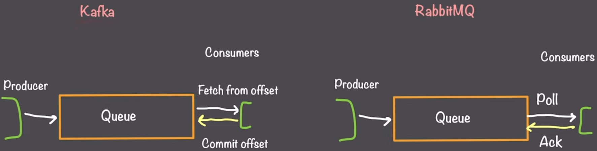

# Kafka vs RabbitMQ vs NATS

## What they are

- Kafka is a [stream processing system](https://en.wikipedia.org/wiki/Stream_processing).
- RabbitMQ and NATS are [traditional message queues](https://en.wikipedia.org/wiki/Message_queue).

## Kafka - Stream Processing

- Extremely high throughput.
- Replay.
- Data retention.
- Fan out by default.

## Tradition Queues - Message queue

- Can handle complex message routing to specific queues.
- Messages intended for one consumer.
- Moderate data volumes.

## Consumer patterns

Fan out vs 1-1 communication:

Kafka is useful for processing ***events*** that are coming in and multiple independent services need to process each of those events;

- It's expected that the services are small and won't be likely to scale horizontally.

RabbitMQ and NATS are great for processing ***messages*** that need to be processed by at least one service.

- The service can scale horizontally indefinitely.

## Message Routing

- In Kafka all message routing is handled by the producer, i.e. the Kafka cluster does not route messages.
  - The producer is responsible for determining with queue its data goes into.
  - The producer can send messages to one or multiple queues.
  - If the producer does not want to fan out there must be:
    - multiple partitions;
    - multiple consumers per partition;
    - hashing on the producer side so that it can determine which partition the message goes into;
    - Benefit: allows for easy scaling of the Kafka cluster because there is no single point in which all messages have to go through to get routed.
    - Cost: No control after the message gets produced of where it actually goes.
- The cluster can have multiple queues organized into topics and partitions.
- Because the cluster does not do routing, it has the potential to have high-throughput.

- RabbitMQ introduces exchanges that take in all messages and route them to different queues.
- It can handle duplicating messages to multiple queues to enable a fan-out style approach.
- Consumers now have control on what messages they are consuming from their queues.
- Benefit: We can balance the load between multiple consumers, especially with tasks that have variable degree of processing time associated with them.

Use Kafka when:

- Messages take uniform and short time to process and can be processed in parallel by multiple independent services.
- Most messages fan out.
- Need extremely high throughput.
- Kafka is designed to have consistent data flow moving through the system at all times.

Use Traditional queues like RabbitMQ and NATS when:

- The messages are long running tasks that can take an unknown time to process.
- Complex routing strategies are required.
- The data flow is going to be sporadic/bursty.

## Acknowledgement

If something goes wrong and a consumer fails to process a message, we need a way to retry and send that message to a different consumer.

- In Kafka there isn't a concept of acknowledgement. Instead, "offsets" are used.
- Kafka logs an offset of how many messages each consumer has received so far.
  - Whenever a consumer needs new data, it fetches data from the queue from that offset: it's getting all new data from the last position it successfully processed from. Once it's done processing, it commits the new offset.
  - If a consumer disconnects before it commits its offsets, Kafka will send that data to another consumer (that consumer will pick up from its last committed offset).

- NATS and RabbitMQ have acknowledgements.
- Consumers poll the queue for new data.
  - When they successfully process it, they send an acknowledgement.
  - If an acknowledgement is not received in a given amount of time, the message will be sent to another consumer.

Thus, the RabbitMQ model works best when we have:

- long-running tasks;
- tasks are processed 1 by 1;
- each task needs to be acknowledged as completed of failed.

The model of committing offsets is great when we have to processes:

- batches of data where each piece of data takes a short time to process;
- large quantities of small events coming in;
- some messages can be dropped and that is regarded as ok.

## Use cases

Kafka:

- Streaming data processing.
- Event bus: multiple services need to processes every incoming messages independently.
- Logging systems: capturing streams of log in a database.
- Real-time communication.

RabbitMQ and NATS:

- Job worker system.
- Message queue.
- Decoupling microservices.

## RabbitMQ vs NATS

- Design Philosophy and Complexity: RabbitMQ provides a more feature-rich and complex system with support for various protocols and complex routing, whereas NATS focuses on simplicity, performance, and ease of use.
- Message Delivery Guarantees: RabbitMQ offers stronger message delivery guarantees and persistence features compared to NATS.
- Operational Overhead: RabbitMQ typically requires more configuration and management, while NATS is known for its minimal operational overhead.
  - For some scenarios using RabbitMQ might be an overkill.

## Reddit comments

- "NATS is the most rock solid open source message queue I've ever used."
- "Kafka is like the NoSQL in the "SQL vs NoSQL" debates. 90 % of the time, you don't want it, and when you want it, you already know why."
- "Nats handled millions of messages for a production orchestration I had daily, K8s, elk, prom. Kafka always feels clunky to me, and no thanks to amqp. I'm obviously biased, but it's mine to have, I suppose."
- "I’ve been using NATS for 2 years with a NodeJS and Go app. I was really worried at the beginning but it has been rock solid so far. Kafka is way too expensive for me. RabbitMQ is too slow. I’m processing 100s of millions of messages per month with 3x$5 VPS. "

## Resources

- When to Use Kafka or RabbitMQ | System Design: <https://www.youtube.com/watch?v=w8xWTIFU4C8>.
- Rabbitmq vs NATS: <https://www.svix.com/resources/faq/rabbitmq-vs-nats/>.
- Comparison of NATS, RabbitMQ, NSQ, and Kafka: <https://gcore.com/learning/nats-rabbitmq-nsq-kafka-comparison/>.
- Which one to use Kafka, Rabbit or NATS at the backend with predominant number of Go lang Microservices: <https://www.reddit.com/r/golang/comments/17aiudy/which_one_to_use_kafka_rabbit_or_nats_at_the/>.
